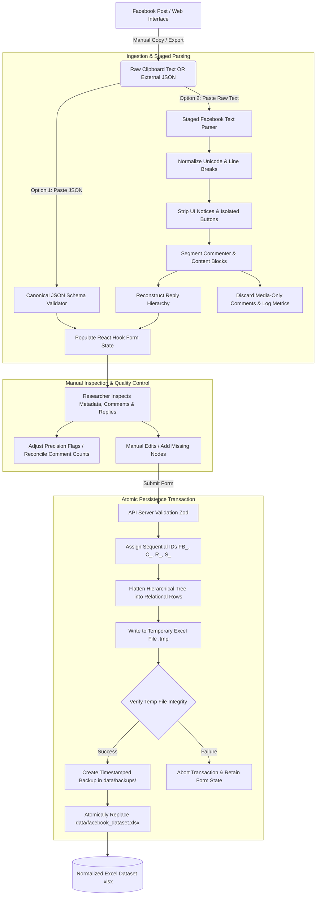

# Facebook Data Collector (Research Utility)

> **DRAFT README** — *This document is an initial, in-depth documentation draft reverse-engineered from the codebase, test suites, and research workflow specifications. It describes actual implementation behaviors, architectural boundaries, data models, and methodological considerations.*

---

## 1. Overview & Project Purpose

**Facebook Data Collector** is a local-first, hierarchical data-entry and extraction utility designed for academic researchers conducting qualitative, quantitative, and computational discourse analysis of social media content. 

Social media research often encounters severe platform-level hurdles: dynamic web interfaces, unannounced DOM structure changes, API access deprecations, opaque algorithmic comment filtering, and inconsistent metadata representations. Automated scrapers frequently break, fail to capture nested reply structures accurately, or apply opaque sanitization that destroys linguistic nuances.

This utility bridges the gap between raw social media observation and rigorous empirical research by providing:
1. **A Structured, Local-First Data Workspace:** A web application (built on Next.js, React, and TypeScript) allowing researchers to manually curate or automatically ingest posts, comments, and recursive reply threads without sending data to third-party cloud servers.
2. **Deterministic Excel (.xlsx) Research Persistence:** Direct mapping of hierarchical social data into a normalized, multi-sheet relational Excel workbook (`POSTS`, `COMMENTS`, `REPLIES`, `SOURCES`, and `CODEBOOK`) backed by atomic file transactions and automatic timestamped backups.
3. **Staged Ingestion & Autofill Pipeline:** Ingestion of raw clipboard text copied directly from Facebook, contextual cleaning of platform interface artifacts, extraction of commenter handles, recovery of parent-child reply relationships, and support for pre-parsed Canonical JSON schemas.
4. **Post-Level Metric Precision Tracking:** Explicit separation between exact numerical metrics, platform-abbreviated approximations (e.g., `1.1K`, `2.5M`), and missing values.
5. **Lossless Text Preservation:** Strict adherence to research data integrity by preserving raw textual phrasing, emojis, punctuation, non-Latin scripts (Assamese, Bengali, Devanagari, etc.), and parent mention prefixes.

### Who Is This For?
- Academic researchers, linguists, political scientists, and sociologists studying social media discourse, political communication, sentiment, or multilingual code-mixing.
- Research teams requiring auditable, reproducible, and verifiable datasets formatted for downstream statistical packages (R, Python/Pandas, SPSS, Stata) or qualitative analysis software (NVivo, ATLAS.ti, MAXQDA).

### What This Tool Does NOT Attempt to Do
- It is **not** an automated headless browser scraper (e.g., Puppeteer/Playwright bot) designed to circumvent Facebook authentication or terms of service.
- It does **not** perform unsupervised black-box batch scraping.
- It does **not** modify or trim user text during persistence.
- It does **not** rely on external cloud databases (all storage is local-first in Excel `.xlsx`).


---

## 2. Key Features

| Category | Implementation Feature | Description |
| :--- | :--- | :--- |
| **Data Ingestion** | **Dual Autofill Pipeline** | Supports both structured **Canonical JSON import** (via file upload or paste) and **Raw Clipboard Text Parsing** with live preview into editable form state before saving. |
| **Parsing Engine** | **Staged Text Extraction** | Regex and heuristic tokenizers normalize Unicode, strip Facebook system notice banners (e.g., *"Most relevant is selected"*), and eliminate isolated UI action buttons (*"Reply"*, *"Like"*). |
| **Hierarchy** | **Infinite Recursive Replies** | Preserves arbitrary-depth conversational threads ($Comment \to Reply \to Reply \to \dots$). Automatically generates relational foreign keys (`parent_id` linking to parent `comment_id` or `reply_id`). |
| **Data Integrity** | **Lossless Preservation** | Never trims, truncates, or modifies user comments, replies, or captions upon storage. Preserves reply-to-author prefixes in text. |
| **Reactions** | **7-Reaction Breakdown** | Detailed tracking of all 7 individual Facebook reactions (**Like**, **Love**, **Haha**, **Wow**, **Sad**, **Angry**, **Care**) across posts, comments, and replies, alongside total reaction aggregates. |
| **Metrics** | **Precision Tracking System** | Distinguishes between `precise` counts (e.g., `1,247`), `approximate` counts (e.g., `1.1K` $\to 1100$), and `unavailable` counts across post-level engagement metrics. Stores both normalized integer and raw display strings. |
| **Persistence** | **Atomic Workbook Writes** | Writes workbook mutations to a temporary `.xlsx` file, verifies structural integrity, creates a timestamped backup in `data/backups/`, and replaces the target file atomically. |
| **Linguistics** | **Language & Script Detection** | Heuristically classifies languages and scripts: English (`en`), Bengali (`bn`), Assamese (`as`), Hindi (`hi`), Bodo (`brx`), Other Indic (`ne`, `other`), and code-mixed/Romanized scripts (`mixed`). |
| **Codebook** | **Embedded Data Dictionary** | Generates and maintains a permanent `CODEBOOK` sheet in the output workbook defining every field, datatype, requirement, and controlled vocabulary. |
| **Workflow** | **Edit & Reopen Support** | Existing post records and their full comment/reply trees can be reloaded from the Excel file, modified, and saved back cleanly. |

---

## 3. System Architecture & Boundaries

The codebase follows a modular architecture with strict boundary enforcement (as governed by `AGENTS.md`):

```
┌──────────────────────────────────────────────────────────────────┐
│                      UI Presentation Layer                       │
│  (src/app/page.tsx, src/app/collect, src/app/edit/[postId])      │
│  - React Hook Form + Zod Resolvers                               │
│  - Autofill Pipeline (JSON / Raw Text Parser UI)                 │
│  - CommentCard & Recursive ReplyCard Tree Components             │
└─────────────────────────────────┬────────────────────────────────┘
                                  │ HTTP JSON Payloads (Client ↔ Server)
                                  ▼
┌──────────────────────────────────────────────────────────────────┐
│                      API Route Layer (Server)                    │
│  (src/app/api/posts, src/app/api/posts/[postId], api/summary)    │
│  - Enforces schema validation via Zod on incoming payloads       │
│  - Bridges UI state to Domain & Persistence services             │
└─────────────────────────────────┬────────────────────────────────┘
                                  │ Direct Function Calls
                                  ▼
┌──────────────────────────────────────────────────────────────────┐
│                  Domain Logic & Ingestion Layer                  │
│  - src/lib/schemas.ts  : Canonical Zod Schemas & Source of Truth │
│  - src/lib/types.ts    : TypeScript interfaces inferred from Zod │
│  - src/lib/ids.ts      : Deterministic Sequence ID Generation    │
│  - src/lib/domain.ts   : Pure Business Logic & Payload Flattening│
│  - src/lib/parser.ts   : Staged Raw Text Parser & Precision Logic│
└─────────────────────────────────┬────────────────────────────────┘
                                  │ Pure Objects
                                  ▼
┌──────────────────────────────────────────────────────────────────┐
│                 Persistence Layer (Server-Side)                  │
│  - src/lib/workbook/WorkbookRepository.ts                        │
│  - src/lib/workbook/mappers.ts (Domain ↔ Excel Row Mappings)     │
│  - src/lib/workbook/templates.ts (Worksheet Definitions)         │
│  - Atomic file write: .tmp -> Verify -> Backup -> Replace Target │
│  - Target: data/facebook_dataset.xlsx                             │
└──────────────────────────────────────────────────────────────────┘
```

### Architectural Guardrails
1. **Server-Side I/O Only:** Client-side components never access the filesystem directly. All Excel interactions occur in API route handlers running in Node.js.
2. **Single Source of Truth (`schemas.ts`):** Controlled vocabularies, field types, and validation schemas originate in `src/lib/schemas.ts`. TypeScript types are inferred directly from Zod to prevent schema drift.
3. **Isolated ID Generation (`ids.ts`):** Deterministic ID sequencing (`FB_000001`, `C_000001`, `R_000001`, `S_000001`) operates independently of UI state.
4. **Non-destructive Ingestion:** Ingestion and parsing populate form memory; database/workbook changes only take place upon explicit submission.

---

## 4. End-to-End Workflow

The research workflow accommodates both manual entry and automated/LLM-assisted pipelines:



### Workflow Steps
1. **Data Acquisition:** The researcher navigates to a target Facebook post, reel, or video. The post metadata (URL, author, published date, view/reaction/share counts) and comments are extracted or copied.
2. **Staged Parsing / JSON Ingestion:** In the `/collect` interface, the researcher uses the **Autofill Pipeline**:
   - *Raw Facebook Text:* Pastes the raw text copied from the browser. The parser strips interface clutter, extracts names, detects language, reconstructs replies, and discards empty/media-only entries.
   - *Canonical JSON:* Pastes or uploads a `.json` file generated from external scripts or LLM preprocessing.
3. **Form Population (Non-Committal):** The parsed comments and replies populate the interactive UI. No disk write has occurred yet.
4. **Researcher Audit & Metric Reconciliation:** The researcher reviews the parsed records, verifies author handles, enters post-level metrics with display precision (e.g., `1.1K`), and reconciles any platform count discrepancies.
5. **Atomic Save:** Upon clicking **"Save Post to Dataset"**:
   - The payload is validated server-side.
   - Deterministic IDs are assigned.
   - Rows are appended to `POSTS`, `COMMENTS`, `REPLIES`, and `SOURCES`.
   - The workbook is written to a temporary file, verified, backed up, and atomically moved into place.

---

## 5. Data Model & Workbook Structure

The output workbook (`data/facebook_dataset.xlsx`) is structured as a relational database containing five distinct worksheets.

### 5.1 Worksheet Architecture

```
                     ┌──────────────────┐
                     │     SOURCES      │
                     ├──────────────────┤
                     │ PK: source_id    │
                     │     source_name  │
                     │     source_type  │
                     └────────┬─────────┘
                              │ (1:N)
                              ▼
                     ┌──────────────────┐
                     │      POSTS       │
                     ├──────────────────┤
                     │ PK: post_id      │◄───────────────┐
                     │     platform     │                │
                     │     post_text    │                │
                     │     metrics...   │                │
                     │     precision... │                │
                     └────────┬─────────┘                │
                              │ (1:N)                    │ (1:N)
                              ▼                          │
                     ┌──────────────────┐                │
                     │     COMMENTS     │                │
                     ├──────────────────┤                │
                     │ PK: comment_id   │                │
                     │ FK: post_id      │                │
                     │     comment_text │                │
                     │     reactions... │                │
                     └────────┬─────────┘                │
                              │ (1:N)                    │
                              ▼                          │
                     ┌──────────────────┐                │
                     │     REPLIES      │                │
                     ├──────────────────┤                │
                     │ PK: reply_id     │                │
                     │ FK: parent_id    ├─┐ (Recursive)  │
                     │ FK: post_id      ├─┴──────────────┘
                     │     reply_text   │
                     │     reactions... │
                     └──────────────────┘
```

### 5.2 POSTS Sheet Specification
Contains one row per post, reel, or video.

| Field Name | Type | Required | Controlled Values / Format | Description & Provenance |
| :--- | :--- | :--- | :--- | :--- |
| `post_id` | String | Yes | `FB_NNNNNN` (e.g., `FB_000001`) | Primary key. Deterministically generated. |
| `platform` | String | Yes | `Facebook` | Platform identifier. |
| `content_type`| Enum | Yes | `Post`, `Reel`, `Video`, `Other` | Type of Facebook content. |
| `post_url` | String | No | Valid URL or blank | Canonical URL of the post. |
| `source_name` | String | Yes | Free text | Name of the Facebook page or profile. |
| `source_type` | Enum | Yes | `News Page`, `Public Figure`, `Political Page`, `Organization`, `Community Page`, `Other` | Categorical classification of the publishing entity. |
| `original_post_date` | String | No | `DD/MM/YYYY` | Date the post was published on Facebook. |
| `collection_date` | String | Yes | `DD/MM/YYYY` | Date the data was captured. |
| `collection_timestamp` | String | Yes | ISO 8601 UTC Timestamp | Exact timestamp of data entry. |
| `language` | Enum | Yes | `English`, `Assamese`, `Bengali`, `Hindi`, `Bodo`, `Mixed`, `Other` | Primary language/script of the post. |
| `post_text` | String | No | Raw text | Full textual content of the post (preserved as-is). |
| `view_count` | Integer | No | Non-negative integer or empty | Normalized integer view count. |
| `view_count_display` | String | No | e.g. `1.1K`, `1,247` | Raw view string as rendered on Facebook. |
| `view_count_precision` | Enum | Yes | `precise`, `approximate`, `unavailable` | Precision indicator for view count. |
| `reaction_count` | Integer | No | Non-negative integer or empty | Normalized total reaction count. |
| `reaction_count_display`| String| No | e.g. `1.2K`, `247` | Raw reaction string as rendered on Facebook. |
| `reaction_count_precision`| Enum| Yes| `precise`, `approximate`, `unavailable` | Precision indicator for total reactions. |
| `like_count` | Integer | No | Non-negative integer or empty | Normalized Like count on the post. |
| `like_count_display` | String | No | Free text | Raw Like string as displayed on Facebook. |
| `like_count_precision` | Enum | Yes | `precise`, `approximate`, `unavailable` | Precision indicator for Likes. |
| `love_count` ... `care_count` | Integer | No | Non-negative integer or empty | 6 additional reaction counts (`love`, `haha`, `angry`, `sad`, `wow`, `care`). |
| `*_count_display` | String | No | Free text | Raw display strings for each individual reaction. |
| `*_count_precision` | Enum | Yes | `precise`, `approximate`, `unavailable` | Precision indicator for each individual reaction. |
| `share_count` | Integer | No | Non-negative integer or empty | Normalized Share count. |
| `share_count_display` | String | No | e.g. `24K`, `150` | Raw Share string as rendered on Facebook. |
| `share_count_precision`| Enum| Yes| `precise`, `approximate`, `unavailable` | Precision indicator for share count. |
| `comment_count` | Integer | No | Non-negative integer or empty | Normalized total comment count. |
| `comment_count_display`| String| No | e.g. `899`, `1.1K` | Raw Comment string as rendered on Facebook. |
| `comment_count_precision`| Enum| Yes| `precise`, `approximate`, `unavailable` | Precision indicator for comment count. |

### 5.3 COMMENTS Sheet Specification
Contains one row per top-level comment.

| Field Name | Type | Required | Controlled Values / Format | Description & Provenance |
| :--- | :--- | :--- | :--- | :--- |
| `comment_id` | String | Yes | `C_NNNNNN` (e.g., `C_000001`) | Primary key. Deterministically generated. |
| `post_id` | String | Yes | `FB_NNNNNN` | Foreign key referencing `POSTS.post_id`. |
| `commenter_name`| String | No | Free text | Display name or handle of the commenter. |
| `comment_text` | String | Yes | Raw text | Full textual content of comment (preserved as-is). |
| `like_count` | Integer | No | Non-negative integer or empty | Like reaction count on comment. |
| `love_count` | Integer | No | Non-negative integer or empty | Love reaction count on comment. |
| `haha_count` | Integer | No | Non-negative integer or empty | Haha reaction count on comment. |
| `wow_count` | Integer | No | Non-negative integer or empty | Wow reaction count on comment. |
| `sad_count` | Integer | No | Non-negative integer or empty | Sad reaction count on comment. |
| `angry_count` | Integer | No | Non-negative integer or empty | Angry reaction count on comment. |
| `care_count` | Integer | No | Non-negative integer or empty | Care reaction count on comment. |
| `reply_count` | Integer | No | Non-negative integer | Total number of nested descendant replies. |
| `collection_timestamp` | String | Yes | ISO 8601 UTC Timestamp | Exact timestamp of entry/extraction. |

### 5.4 REPLIES Sheet Specification
Contains one row per reply, supporting arbitrary recursive nesting depth.

| Field Name | Type | Required | Controlled Values / Format | Description & Provenance |
| :--- | :--- | :--- | :--- | :--- |
| `reply_id` | String | Yes | `R_NNNNNN` (e.g., `R_000001`) | Primary key. Deterministically generated. |
| `parent_id` | String | Yes | `C_NNNNNN` or `R_NNNNNN` | Foreign key referencing immediate parent comment or parent reply. |
| `post_id` | String | Yes | `FB_NNNNNN` | Foreign key referencing root `POSTS.post_id`. |
| `commenter_name`| String | No | Free text | Display name or handle of the replier. |
| `reply_text` | String | Yes | Raw text | Full textual content of reply including author prefix. |
| `like_count` ... `care_count` | Integer | No | Non-negative integer or empty | 7 individual reaction counts on the reply. |
| `collection_timestamp` | String | Yes | ISO 8601 UTC Timestamp | Exact timestamp of entry/extraction. |

### 5.5 SOURCES & CODEBOOK Sheets
- **`SOURCES`:** Maintains a normalized directory of sources (`source_id` matching `S_NNNNNN`, `source_name`, `source_type`). Automatically deduplicated upon post insertion.
- **`CODEBOOK`:** Embedded reference sheet containing schema metadata, datatypes, and controlled vocabularies.

---

## 6. Parsing & Text Normalization Engine

The parser implementation (`src/lib/parser.ts`) operates through discrete, verifiable stages:

```
[Raw Clipboard Text]
        │
        ▼
[1. Unicode & Whitespace Normalization]
   - Normalize CRLF/CR to LF
   - Replace non-breaking spaces (\u00A0, \u2000-\u200A, \u202F, \u3000) with standard space
   - Strip zero-width non-character spaces (\u200B-\u200D, \uFEFF)
        │
        ▼
[2. Interface Clutter & Notice Filtering]
   - Regex-filter notice banners ("Most relevant is selected", "Top comments", "Write a comment...")
   - Filter standalone action buttons ("Reply", "उत्तर दिन", "উত্তৰ দিয়ক", "जवाब दें", "Like")
        │
        ▼
[3. Structural Segmentation]
   - Detect author header patterns: [Name] + [Separator ·/•] + [Timestamp]
   - Segment text into raw comment blocks
   - Discard media-only / empty text blocks (tracked in ParseMetrics)
        │
        ▼
[4. Hierarchy Reconstruction]
   - Scan leading text for known parent commenter names
   - Match replies to parent comments while preserving author prefixes in reply_text
        │
        ▼
[5. Canonical Dataset & Metric Emission]
   - Output CanonicalDataset + ParseMetrics
```

### 6.1 What Gets Cleaned (Transformative/Filter Stage)
- **Facebook System UI Text:** Standard notice banners (e.g., *"Most relevant is selected"*, *"All comments"*, *"View more replies"*, *"Press enter to post"*) are removed to avoid polluting linguistic analysis.
- **Isolated Action Triggers:** Lone *"Reply"*, *"Like"*, *"React"*, and *"Share"* lines created when users copy the full DOM tree are stripped.
- **Zero-Width Artefacts:** Invisible Unicode joiners and zero-width spaces (`\u200B`–`\u200D`, `\uFEFF`) are purged.

### 6.2 What Gets Preserved (Lossless Stage)
- **Full Comment & Reply Wording:** Punctuation, capitalization, misspellings, colloquial expressions, and emojis are strictly preserved.
- **Parent Mention Prefixes:** When a reply begins with `@ParentName` or `ParentName `, the parser uses the name for hierarchical linking but **does not strip it from `reply_text`**.
- **Multilingual Glyphs & Indic Diacritics:** Script integrity is maintained across complex conjuncts and combining characters.

### 6.3 Media-Only Discarding Policy
Comments consisting solely of stickers, images, GIFs, or empty attachment tags produce no meaningful textual corpus data. The parser discards these records and increments `metrics.mediaOnlyDiscarded` to maintain transparency regarding missing data.

---

## 7. Multilingual & Indic Script Considerations

The collector is designed for South Asian social media contexts characterized by heavy linguistic diversity and script mixing.

```
                  ┌─────────────────────────────────────────┐
                  │          Text Character Scanner         │
                  └────────────────────┬────────────────────┘
                                       │
            ┌──────────────────────────┼──────────────────────────┐
            ▼                          ▼                          ▼
   [Bengali Unicode]          [Assamese Specific]       [Devanagari Unicode]
  (\u0980 - \u09FF)          ('ৰ' \u09F0, 'ৱ' \u09F1)    (\u0900 - \u097F)
            │                          │                          │
            ▼                          ▼                          ▼
     Classified: bn             Classified: as             Classified: hi
            │                          │                          │
            └──────────────────────────┼──────────────────────────┘
                                       │
                       ┌────────────────┴────────────────┐
                       ▼                                 ▼
              [Mixed Indic + Latin]             [Pure Latin Script]
                       │                                 │
                       ▼                                 ▼
                Classified: mixed            [Phonetic Bengali Token Scanner]
                                              ("oder", "bhalo", "kichu", ...)
                                                         │
                                            ┌────────────┴────────────┐
                                            ▼                         ▼
                                     >= 2 Matches                < 2 Matches
                                            │                         │
                                            ▼                         ▼
                                    Classified: mixed         Classified: en
```

### Supported Scripts & Detection Heuristics
1. **Bengali (`bn`):** Character codes in `\u0980`–`\u09FF`.
2. **Assamese (`as`):** Differentiated from Bengali by the explicit presence of unique Assamese glyphs: `ৰ` (`\u09F0`, *ro*) and `ৱ` (`\u09F1`, *wo*).
3. **Hindi / Devanagari (`hi`):** Character codes in `\u0900`–`\u097F`.
4. **Bodo (`brx`) & Nepali (`ne`):** Mapped to controlled ISO options.
5. **Code-Mixed / Romanized Bengali (`mixed`):** Comments written in Latin script with phonetic Indic vocabulary (e.g., *"bhalo"*, *"kemon"*, *"desher"*, *"shob"*, *"hobe"*) are identified via a phonetic token dictionary.

> [AUTHOR: Add any additional regional languages, dialects, or custom phonetic token sets relevant to your research corpus.]

---

## 8. Post-Level Metric Precision Tracking System

Facebook displays numbers in different formats depending on viewport size, interface language, and view count scale. Converting `"1.1K"` directly to `1100` without recording that it was an approximation causes methodological issues in quantitative research.

This tool implements a **Precision Tracking System** for all post-level engagement metrics:

```
[Raw Facebook Metric Input]
           │
           ├──────────────────────────────┬──────────────────────────────┐
           ▼                              ▼                              ▼
    [Exact String]              [Abbreviated String]            [Empty / Null]
   e.g. "1,247 views"              e.g. "1.1K views"               e.g. "" or null
           │                              │                              │
           ▼                              ▼                              ▼
  Normalized: 1247               Normalized: 1100               Normalized: null
  Display: "1,247"               Display: "1.1K"                Display: undefined
  Precision: precise             Precision: approximate         Precision: unavailable
```

### Precision Schema
For every post metric (`view_count`, `reaction_count`, `like_count`, `love_count`, `haha_count`, `angry_count`, `sad_count`, `wow_count`, `care_count`, `share_count`, `comment_count`):
- `[metric]_count`: Normalized integer value (or `null`).
- `[metric]_count_display`: Original verbatim string from Facebook UI (e.g., `"1.1K"`, `"1,247"`).
- `[metric]_count_precision`: Controlled status:
  - `precise`: Exact digit count verified without abbreviation.
  - `approximate`: Derived from shorthand multiplier ($K=1,000$, $M=1,000,000$, $B=1,000,000,000$).
  - `unavailable`: Metric not present, hidden, or zero-display.

*Note: Comment and reply reaction counts do not use precision metadata since individual comments display exact integer reaction badges on Facebook.*

---

## 9. Handling Source-Data Inconsistencies (The Comment-Count Discrepancy)

### 9.1 The Empirical Discrepancy Phenomenon
During empirical social media data collection, researchers frequently observe that Facebook presents conflicting comment counts for the exact same post across different interface elements.

In one analyzed research case, the platform reported three contradictory totals for a single post:
- **Internal JSON API representation:** `885` comments
- **Comments section header:** `899` comments
- **Counter displayed under the post body:** `940` comments

### 9.2 Research Workflow Policy
In this research workflow, the **comments-section value (e.g., 899)** was selected as the recorded `comment_count` value for the post record.

### 9.3 Methodological Context & Data-Quality Caveat
The choice of the comments-section value is a **workflow convention**, not an assertion that Facebook's comments-section number is inherently authoritative.

Researchers should account for the following factors when analyzing comment counts:
1. **Algorithmic Filtering:** Facebook dynamically hides comments classified as spam, low-quality, or violating platform guidelines under default view settings (*"Most Relevant"* vs *"All Comments"*).
2. **Deleted / Deactivated Accounts:** Deleted comments may decrement internal database counters asynchronously while remaining cached in UI counters.
3. **Ghost / Unrendered Replies:** Sub-threads may be counted in high-level aggregate counters even if individual reply nodes cannot be rendered or copied from the DOM.
4. **Sampling Provenance:** Researchers must document the provenance of recorded totals in their methodology section and verify whether the number reflects top-level comments alone, total visible replies, or an unverified platform counter.

---

## 10. LLM / AI-Assisted Processing & Large Datasets

When working with large research corpora, researchers may use Large Language Models (LLMs) or external scripts to preprocess raw text into JSON before importing it into this tool.

### 10.1 Canonical JSON Contract
External preprocessing scripts or LLM prompts should output JSON adhering to the canonical schema:

```json
{
  "comments": [
    {
      "commenter_name": "Gopal Ch Saha",
      "comment_text": "ভারতীয় তারকাটা, সীমান্ত শূন্য রেখা থেকে কম করে ১৫০ গজ দূরে অবস্থিত ।",
      "like_count": 0,
      "love_count": 0,
      "haha_count": 0,
      "wow_count": 0,
      "sad_count": 0,
      "angry_count": 0,
      "care_count": 0,
      "replies": [
        {
          "commenter_name": "Chandrani Sarkar",
          "reply_text": "Gopal Ch Saha Oder ar moja maranor kichhu nai...",
          "like_count": 0,
          "love_count": 0,
          "haha_count": 0,
          "wow_count": 0,
          "sad_count": 0,
          "angry_count": 0,
          "care_count": 0,
          "replies": []
        }
      ]
    }
  ]
}
```

### 10.2 Methodological Risks of LLM Preprocessing
1. **Hallucination & Paraphrasing:** LLMs may inadvertently summarize, correct grammar, or alter non-standard dialectal spellings. Prompts must strictly enforce verbatim, lossless text extraction.
2. **Context Window & Truncation:** Large comment sections (e.g., >500 comments) exceed typical context limits or trigger loss of attention over long contexts. Datasets should be chunked into batches of 50–100 comments.
3. **Non-Deterministic Parsing:** Identical raw text passed to an LLM multiple times may produce differing JSON tree structures.
4. **Auditability Requirement:** Always archive raw clipboard text alongside LLM-generated JSON to ensure data provenance and reproducibility.

> [AUTHOR: If you use a specific LLM prompt template, model version (e.g., Gemini 1.5 Pro, Claude 3.5 Sonnet, GPT-4o), or batching script in your workflow, document or link it here.]

---

## 11. Project Structure

```text
facebook-data-entry/
├── AGENTS.md                   # Strict architecture boundaries and safety rules
├── CLAUDE.md                   # AI assistant entry point linking to AGENTS.md
├── LICENSE                     # MIT License (Copyright (c) 2026 antarjit-das)
├── README.md                   # This comprehensive documentation file
├── eslint.config.mjs           # ESLint configuration
├── next.config.ts              # Next.js 16 configuration
├── package.json                # Project dependencies and script definitions
├── tsconfig.json               # TypeScript configuration
├── data/
│   ├── facebook_dataset.xlsx   # Primary active SQLite/Excel relational research workbook
│   └── backups/                # Timestamped .xlsx backups created on every atomic write
├── src/
│   ├── app/
│   │   ├── globals.css         # Minimalist dark research UI stylesheet
│   │   ├── layout.tsx          # Root application layout and metadata
│   │   ├── page.tsx            # Research dashboard & persisted records overview table
│   │   ├── collect/
│   │   │   └── page.tsx        # Post collection workspace (+ Add Post)
│   │   ├── edit/[postId]/
│   │   │   └── page.tsx        # Reopen & edit existing post/comment records
│   │   └── api/
│   │       ├── summary/
│   │       │   └── route.ts    # GET /api/summary (Dashboard dataset counts)
│   │       └── posts/
│   │           ├── route.ts    # GET /api/posts (List), POST /api/posts (Save new)
│   │           └── [postId]/
│   │               └── route.ts# GET /api/posts/[id] (Load), PUT /api/posts/[id] (Update)
│   ├── components/
│   │   ├── common/
│   │   │   └── StatusBar.tsx   # Visual status and error indicator
│   │   └── post/
│   │       ├── AutofillSection.tsx # Dual JSON / Raw Text import pipeline
│   │       ├── PostForm.tsx    # Primary post entry and metric form
│   │       ├── CommentCard.tsx # Comment card with 7 reactions accordion
│   │       └── ReplyCard.tsx   # Recursive reply card component
│   └── lib/
│       ├── domain.ts           # Business rules, payload preparation, tree flattening
│       ├── ids.ts              # Deterministic sequential ID generation (FB_, C_, R_, S_)
│       ├── parser.ts           # Staged text parser, language detector, precision logic
│       ├── schemas.ts          # Zod validation schemas (Single Source of Truth)
│       ├── types.ts            # Derived TypeScript types & API contract interfaces
│       └── workbook/
│           ├── templates.ts    # Sheet definitions, column headers, CODEBOOK content
│           ├── mappers.ts      # Lossless bidirectional domain <-> Excel row mappers
│           └── WorkbookRepository.ts # Atomic file writes, verification, and backup engine
└── tests/
    └── parser.test.ts          # 26 automated unit & round-trip integration tests
```

---

## 12. Installation & Setup

### 12.1 Prerequisites
- **Node.js:** v20.x or later (tested on Node v20/v22)
- **Package Manager:** `npm`, `pnpm`, or `yarn`

### 12.2 Installation Steps

1. **Clone the repository:**
   ```bash
   git clone https://github.com/antarjit-das/fb-manual-dataentry-UI.git
   cd facebook-data-entry
   ```
   > [AUTHOR: Verify and update repository URL if hosted on a different remote.]

2. **Install dependencies:**
   ```bash
   npm install
   ```

3. **Verify tests:**
   ```bash
   npm test
   ```

4. **Start the local development server:**
   ```bash
   npm run dev
   ```

5. **Open the application:**
   Navigate to [http://localhost:3000](http://localhost:3000) in your web browser.

---

## 13. Configuration & Environment Variables

The application functions out of the box with zero external configuration. If custom file paths are needed, configure them via environment variables:

| Variable Name | Default Value | Description |
| :--- | :--- | :--- |
| `WORKBOOK_PATH` | `./data/facebook_dataset.xlsx` | Relative or absolute path to the active Excel dataset file. |
| `BACKUP_DIR` | `./data/backups` | Directory where timestamped backups are automatically written before each write. |
| `PORT` | `3000` | Local port for the Next.js development server. |

Example `.env.local`:
```env
WORKBOOK_PATH=./data/facebook_dataset.xlsx
BACKUP_DIR=./data/backups
```

---

## 14. Error Handling & Data Safety

The system implements safety rules to prevent data loss or silent file corruption:

1. **Atomic Write Pipeline (`WorkbookRepository.ts`):**
   - Saves are written to `facebook_dataset.xlsx.tmp`.
   - The temporary file is re-read in memory and validated for required worksheets (`POSTS`, `COMMENTS`, `REPLIES`).
   - If verification fails, `.tmp` is unlinked and the active database remains untouched.
   - If verification succeeds, a backup (`facebook_dataset_backup_YYYY-MM-DD_HH-mm-ss.xlsx`) is stored in `data/backups/`.
   - The `.tmp` file atomically replaces the active `.xlsx` file via `fs.renameSync`.
2. **Non-Destructive Form State:** If an API route fails or validation rejects a payload, form fields retain all entered text, comments, and replies, displaying the error message in the UI status bar.
3. **Unsaved Changes Navigation Warning:** The `/collect` and `/edit` pages attach `beforeunload` event listeners to warn researchers before accidentally closing browser tabs containing unsaved records.
4. **Defensive Collision Detection:** `ids.ts` scans existing IDs in the workbook and throws an error if an ID collision is detected before persisting rows.

---

## 15. Limitations & Methodological Considerations

### 15.1 Technical Limitations
- **Local File Lock Concurrency:** ExcelJS writes to local `.xlsx` files synchronously with file locking. The tool is designed for single-researcher or sequential usage; simultaneous concurrent writes from multiple clients to the same file are not supported.
- **Large Dataset Scalability:** For datasets containing over 50,000 comments per workbook, reading and writing large Excel files via ExcelJS can experience elevated memory usage during save operations.
- **Parsing Variations across FB UI Versions:** Facebook frequently changes CSS classes, button labels, and separator characters (`·`, `•`, `.`). Significant platform layout shifts may require updating pattern expressions in `src/lib/parser.ts`.

### 15.2 Methodological & Research Limitations
- **Platform Sampling Bias:** Comments visible on the Facebook DOM are subject to algorithmic ranking (*"Most relevant"*). Unless the researcher explicitly switches the interface to *"All comments"*, the collected sample reflects Facebook's engagement optimization rather than a random distribution.
- **Deleted & Moderated Data:** Comments deleted by users or removed by page moderators prior to collection cannot be recovered.
- **Non-Standard Script & Slang Variations:** Heuristic language detection based on character blocks and Romanized dictionaries is indicative, not definitive. Researchers conducting quantitative sociolinguistic studies should perform formal linguistic validation.

---

## 16. Privacy, Security & Research Ethics

When collecting and analyzing social media data, researchers must adhere to ethical standards and institutional guidelines:

1. **Personal Identifiable Information (PII):** By default, commenter names and text are preserved verbatim for qualitative provenance. Researchers publishing research artifacts or releasing open datasets must consider whether to anonymize or pseudonymize commenter handles (e.g., replacing names with synthetic IDs) in accordance with IRB guidelines.
2. **Local Data Confinement:** No scraped social data or user credentials are transmitted across external networks by this software.
3. **Institutional Review Board (IRB) Compliance:** Academic users must ensure their research protocol complies with their institution's human subjects research policies regarding public vs private social media data.
4. **Terms of Service Considerations:** This tool is an assistive research aid for manual data collection. Researchers are responsible for ensuring their data acquisition methods comply with platform terms and local legal frameworks.

---

## 17. Current Implementation Status

| Component / Subsystem | Status | Implementation Details |
| :--- | :--- | :--- |
| **Next.js 16 Web Dashboard** | ✅ Implemented | Live overview cards, dataset count summary, recent post records table. |
| **Post Collection Form** | ✅ Implemented | Full post metadata, DD/MM/YYYY dates, auto-timestamping, 7 post-level reactions. |
| **Precision Tracking Engine** | ✅ Implemented | Tri-state precision (`precise`, `approximate`, `unavailable`) across all post metrics. |
| **Recursive Comment & Reply Tree**| ✅ Implemented | Arbitrary-depth nested replies via recursive React components and form arrays. |
| **Autofill Pipeline (JSON Import)**| ✅ Implemented | Full JSON validation against `CanonicalDatasetSchema`, client-side population. |
| **Raw Clipboard Text Parser** | ✅ Implemented | Staged tokenization, UI banner filtering, name extraction, language detection. |
| **Atomic Excel Persistence** | ✅ Implemented | `.tmp` file verification, automatic timestamped backups, atomic rename. |
| **Edit & Reopen Records** | ✅ Implemented | Load post by ID, reconstruct hierarchical tree from flat rows, update database. |
| **Automated Test Suite** | ✅ Implemented | 26 unit and integration test suites passing in Node test runner. |
| **Direct CSV / Parquet Export**| ⏳ Planned | Currently outputs standard `.xlsx` (which can be exported to CSV/Parquet via Pandas). |

---

## 18. Author Review & TODO Checklist

> [!IMPORTANT]
> **To the Author / Project Owner:**
> Please review and update the bracketed items below before finalizing this documentation:

- [ ] **[AUTHOR: Research Project Details]** — Add formal project title, lab/group name, and research grant / funding information in Section 1.
- [ ] **[AUTHOR: Repository Remote URL]** — Confirm git clone URL in Section 12.
- [ ] **[AUTHOR: Preferred Citation Format]** — Update the BibTeX entry in Section 19 with actual publication or repository details.
- [ ] **[AUTHOR: Data Acquisition Methodology]** — Document the specific browser extensions, manual inspection steps, or pre-processing scripts used to copy data from Facebook.
- [ ] **[AUTHOR: Indic Dialect Additions]** — Add any specialized regional language rules, dictionaries, or stopwords into Section 7 if applicable.
- [ ] **[AUTHOR: Data Anonymization Protocol]** — Document whether public releases of the dataset will apply pseudonymization to commenter names.

---

## 19. Citation & Academic Attribution

If you use this utility tool or data structure in your research, please cite it as follows:

```bibtex
@misc{das2026facebookdatacollector,
  author = {Das, Antarjit},
  title = {Facebook Data Collector: A Local-First Research Utility for Hierarchical Social Media Discourse Analysis},
  year = {2026},
  publisher = {GitHub},
  journal = {GitHub repository},
  howpublished = {\url{https://github.com/antarjit-das/fb-manual-dataentry-UI}}
}
```

> [AUTHOR: Replace with preferred publication citation, thesis citation, or DOI when available.]

---

## 20. License

This project is licensed under the **MIT License** — see the [LICENSE](LICENSE) file for details:

```text
MIT License
Copyright (c) 2026 antarjit-das
```

